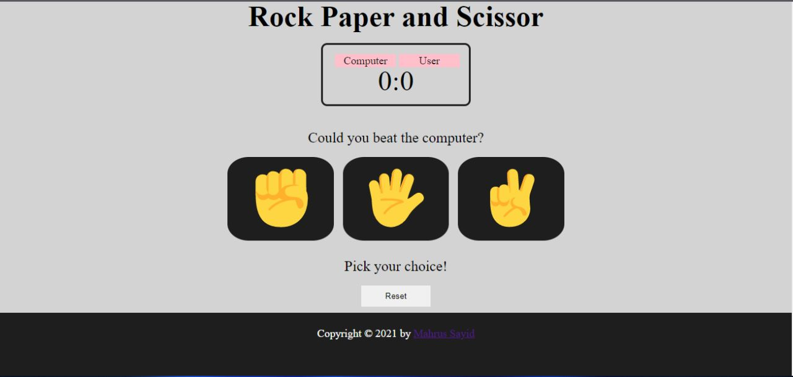

# Minigame - Rock and Scissors

This is simple minigame using JavaScript

## Author

Written by [Mahrus Sayid](https://github.com/mahrus-rohisyam).

## Clone and Running the project

- Clone the code by executing `git clone` on your terminal.
- This is pure HTML, CSS and JS document, you can run it with [Live Preview](https://marketplace.visualstudio.com/items?itemName=ms-vscode.live-server) on VSCode.

## Explanation

You can see the full explanation at [Webinar Series - Create Minigame | Day 1](https://docs.google.com/presentation/d/1qSD-7-EeOe-f7ao8vuw-hfYiCTORXEFwlD4lPDrJYyo/)

## Source

+ Thanks to [Free Code Camp](https://freecodecamp.com) who inspired me to create this simple game 
